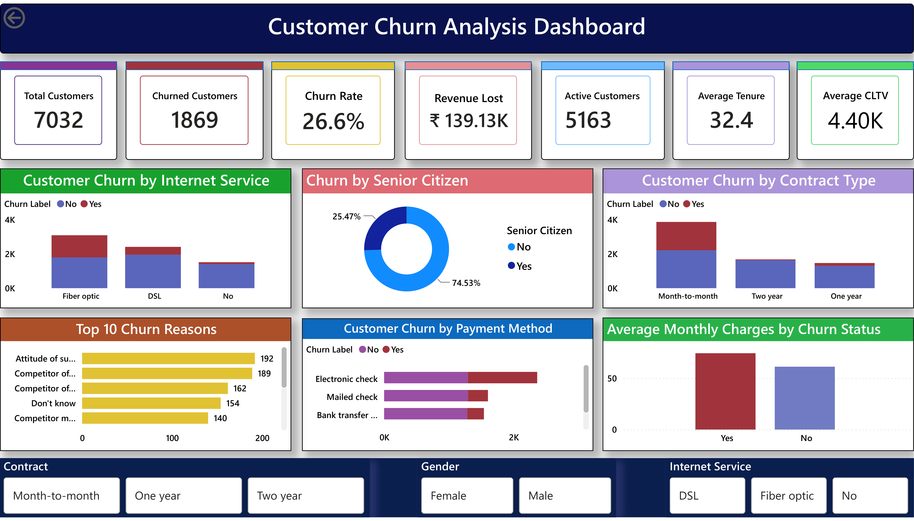

# 📊 Customer Churn Prediction & Analysis

An end-to-end Customer Churn Prediction and Analysis project that combines **SQL, Python, Machine Learning, and Power BI** to analyze customer behavior, predict churn, and provide actionable business insights through an interactive dashboard.

---

# 📌 Project Overview

Customer churn is one of the biggest challenges for subscription-based businesses. This project focuses on analyzing customer data, identifying churn patterns, building predictive machine learning models, and visualizing key business insights.

The project covers:

- SQL-based data analysis
- Data cleaning and preprocessing
- Exploratory Data Analysis (EDA)
- Feature Engineering
- Machine Learning Model Development
- Model Evaluation
- Interactive Power BI Dashboard
- Business Insights & Recommendations

---

# 🛠️ Tech Stack

- SQL
- Python
- Pandas
- NumPy
- Matplotlib
- Seaborn
- Scikit-learn
- Logistic Regression
- Random Forest Classifier
- Power BI
- Jupyter Notebook
- Git & GitHub

---

# 📂 Project Structure

```text
Customer-Churn-Prediction-and-Analysis/
│
├── Churn_Dashboard.pbix                 # Power BI Dashboard
├── Churn_Dashboard.pdf                  # Dashboard PDF
├── Churn_Dashboard.png                  # Dashboard Preview
├── customer_churn.sql                   # SQL Queries
├── customer_churn_analysis-2.ipynb      # Python Analysis & Machine Learning
├── Telco_customer_churn.csv             # Original Dataset
├── telco_customer_churn_clean.csv       # Cleaned Dataset
└── README.md
```

---

## 🗄️ SQL Analysis

The project includes SQL scripts used to create the database, import customer data, and perform business analysis.

### SQL Tasks Performed
- Database and table creation
- Data import and preprocessing
- Customer churn analysis using SQL
- Revenue and customer segmentation analysis
- Aggregations using GROUP BY
- Filtering using WHERE and HAVING
- Window functions
- Common Table Expressions (CTEs)
- Business insights through SQL queries

---

# 🐍 Python Analysis

Performed complete data preprocessing using Python.

### Tasks Performed

- Data Loading
- Data Cleaning
- Missing Value Handling
- Duplicate Checking
- Data Type Conversion
- Label Encoding
- Feature Scaling
- Exploratory Data Analysis (EDA)
- Data Visualization

---

# 🤖 Machine Learning

Two machine learning models were implemented for customer churn prediction.

### Models Used

- Logistic Regression
- Random Forest Classifier

### Model Evaluation

The models were evaluated using:

- Accuracy Score
- Confusion Matrix
- Precision
- Recall
- F1-Score
- Classification Report

The Random Forest model achieved better predictive performance and was selected as the preferred model.

---

# 📈 Power BI Dashboard

An interactive Power BI dashboard was developed to visualize customer churn insights.

### KPI Cards

- Total Customers
- Active Customers
- Churned Customers
- Churn Rate
- Revenue Lost
- Average Tenure
- Average CLTV

### Dashboard Visualizations

- Customer Churn by Contract Type
- Customer Churn by Internet Service
- Customer Churn by Payment Method
- Churn Distribution by Senior Citizen
- Average Monthly Charges by Churn Status
- Top Churn Reasons

### Interactive Filters

- Contract
- Gender
- Internet Service

The dashboard enables users to interactively explore churn trends, customer behavior, and business performance.

---

# 💡 Key Business Insights

- Customers with **Month-to-Month contracts** exhibit the highest churn rate.
- **Fiber Optic** users are more likely to churn compared to DSL users.
- Customers using **Electronic Check** as their payment method have a higher churn rate.
- Higher **Monthly Charges** are associated with increased customer churn.
- Senior Citizens show a relatively higher churn tendency.
- Contract type and internet service are among the strongest indicators of customer churn.

---

# 📷 Dashboard Preview




---

## 🚀 How to Run

### 1. Clone the repository

```bash
git clone https://github.com/Chhavi232/Customer-Churn-Prediction-and-Analysis.git
```

### 2. Install required libraries

```bash
pip install pandas numpy matplotlib seaborn scikit-learn
```

### 3. Open the Jupyter Notebook

Open

```
customer_churn_analysis-2.ipynb
```

and run all cells.

### 4. Open the Dashboard

Open

```
Churn_Dashboard.pbix
```

using Microsoft Power BI Desktop.

# 🎯 Skills Demonstrated

- SQL
- Data Cleaning
- Data Preprocessing
- Exploratory Data Analysis (EDA)
- Feature Engineering
- Machine Learning
- Logistic Regression
- Random Forest
- Model Evaluation
- Data Visualization
- Power BI Dashboard Development
- Business Intelligence
- Data Analytics

---

# 📈 Future Improvements

- Hyperparameter Tuning
- XGBoost Implementation
- Customer Churn Prediction Web App using Streamlit
- Model Deployment using Flask/FastAPI
- Real-Time Dashboard Integration

---


**Chhavi Mittal**

